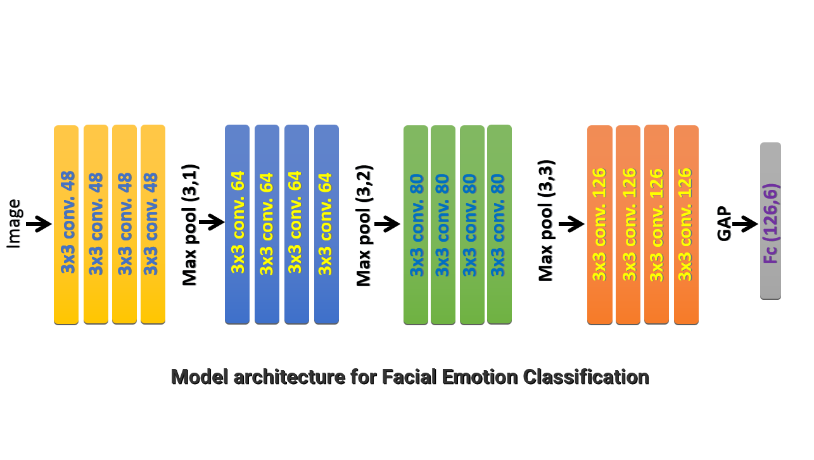
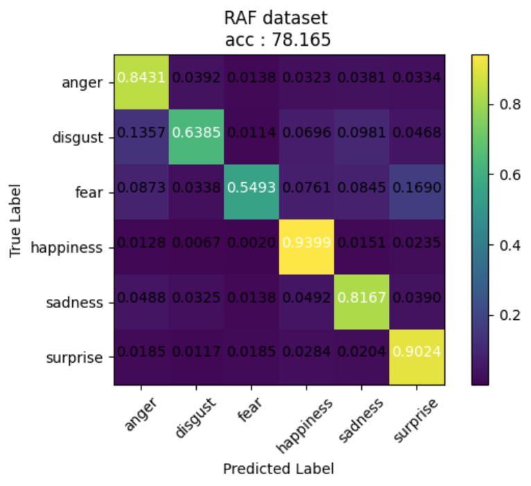
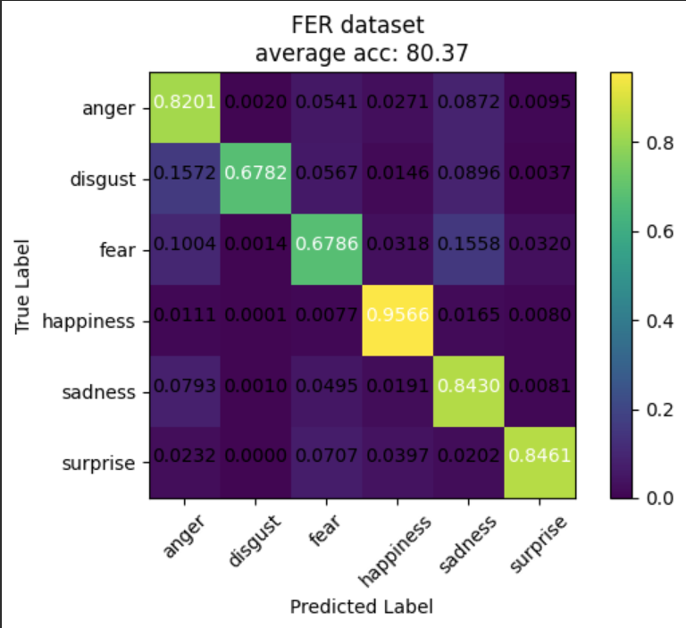
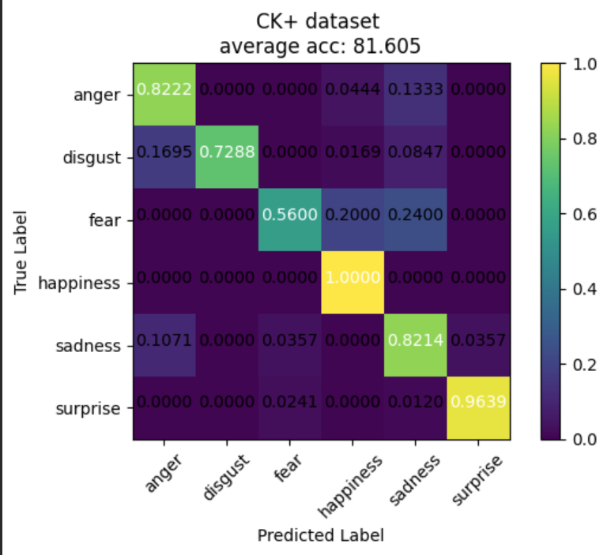
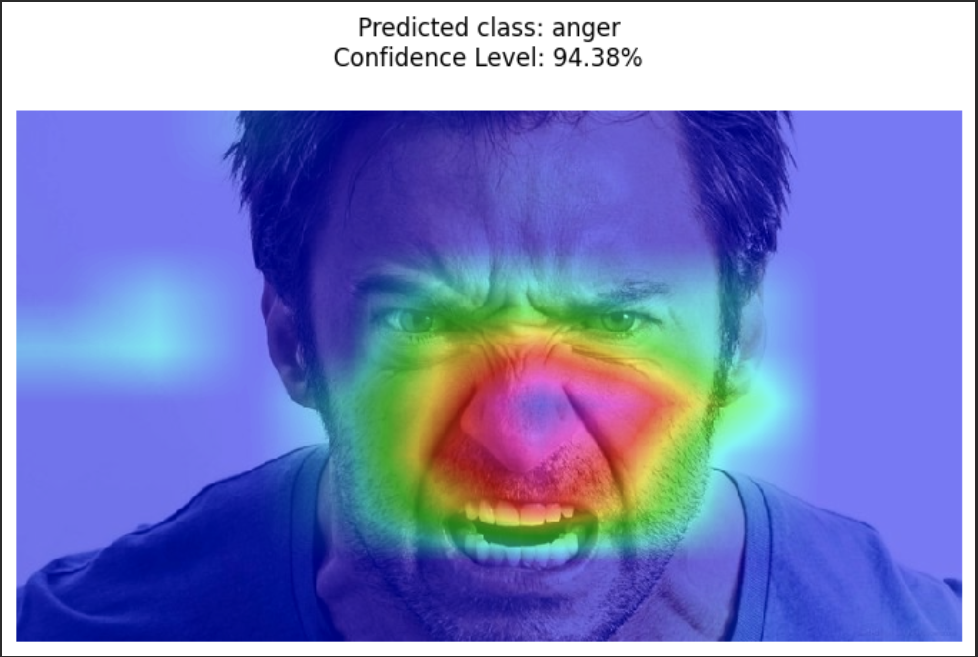
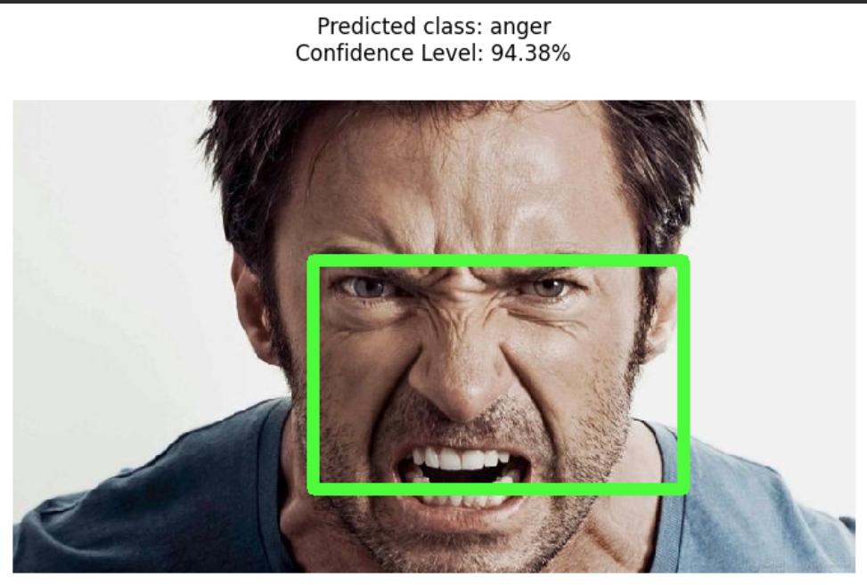

# Facial-Emotions-Detector
detection and classification Emotions on the face
## Abstract
This work presents a Convolutional Neural Network (CNN) model for facial emotion classification using deep learning techniques. Leveraging a diverse dataset of annotated facial images, the proposed model demonstrates effective recognition of emotions including happiness, sadness, anger, surprise, fear, and disgust. Through experimentation and optimization, the model showcases promising performance metrics, suggesting its potential application in affective computing, human-computer interaction, and sentiment analysis domains.

## Preprocessing
The input for the final model consists of fixed-size 64 × 64 RGB images. Each dataset's images were standardized to achieve zero mean and unit variance per color channel. This was accomplished by subtracting the mean RGB value computed from the training set from each pixel and then dividing the result by the RGB standard deviation of the training set. To enhance the model's robustness against translation, rotation, and scaling, as well as to artificially enrich the data, the dataset underwent augmentation by randomly rotating (±10°) and horizontally flipping the images.

## Model Architecture

## Results

## Grad-CAM(XAI)
Grad-CAM, which stands for Gradient-weighted Class Activation Mapping, is an Explainable Artificial Intelligence(XAI) technique used in deep learning, especially with convolutional neural networks (CNNs), to understand what parts of an image are most important to the network's prediction for a particular class.

## Bounding box for predicted class

## Demo

  

